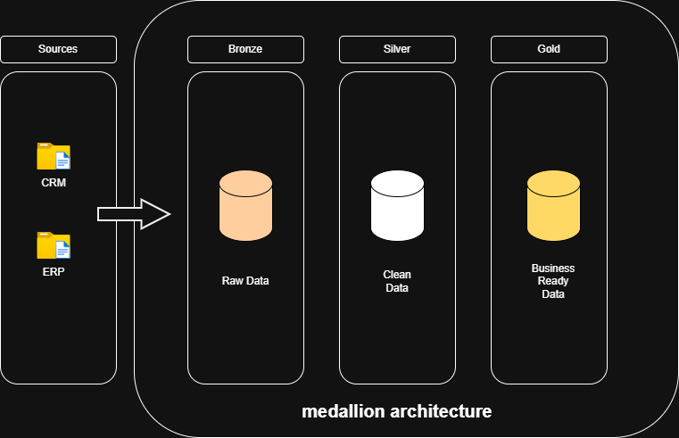
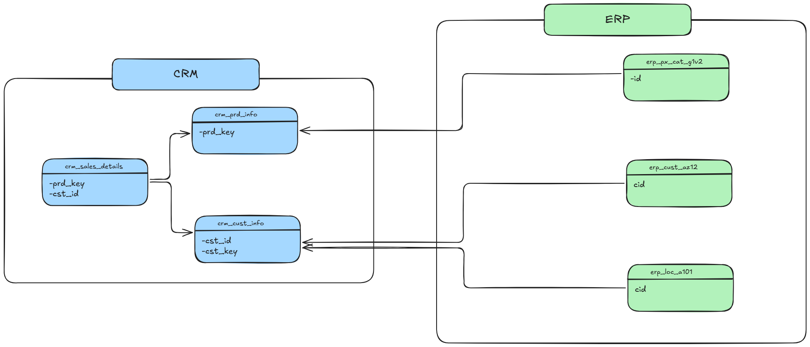

# Data Warehouse Project

A data warehousing project designed to ingest, transform, and model raw operational data into an analytics-ready database.

## 📌 Project Overview (What & Why)
Operational databases (OLTP) are optimized for fast transactions, making them inefficient for complex analytical queries. 

This project solves that by building a centralized **Data Warehouse (OLAP)**. It ingests raw datasets, cleanses them through an ETL/ELT pipeline, and organizes them into a schema optimized for business intelligence and rapid querying.

## 🏗️ System Architecture (How)

### High-Level Architecture

## 📊 Data Modeling & Relationships (How)
The warehouse uses a **Star Schema** to isolate business metrics from descriptive attributes, reducing join complexity and speeding up query performance.

## 🔄 Data Pipeline Layers (Medallion Architecture)

### 🥉 Bronze Layer: Raw Data Ingestion
* **Schema Definition:** Created structured schemas for all source files to ensure a consistent ingestion landing zone.
* **Bulk Ingestion:** Imported raw CSV data directly into the database tables using optimized bulk insert operations.

### 🥈 Silver Layer: Data Cleaning & Integrity
* **Type Casting & Missing Values:** Cleaned the raw data by enforcing correct data types and handling missing or null values.
* **Relational Integrity:** Established strict data constraints by defining Primary Keys (PK) and Foreign Keys (FK).

### 🥇 Gold Layer: Analytical Modeling
* **Star Schema Implementation:** Transformed validated silver data into an optimized dimensional model.
* **Table Creation:** Successfully decoupled the data into a centralized fact table (`fact_sales`) and descriptive dimension tables (`dim_customers`, `dim_products`) for rapid business intelligence querying.

### Entity-Relationship Diagram (ERD)

* **Fact Table:** fact_sales (Measures, quantities, and foreign keys)
* **Dimension Tables:** dim_customers, dim_products (Descriptive attributes)

## 🎯 Project Outcomes Summary

This project successfully builds a high-performance Data Warehouse by implementing a structured 3-tier Medallion Architecture within SQL Server Management Studio (SSMS) 22. By shifting from an operational data structure to an analytical Star Schema, the pipeline eliminates query bottlenecks and reduces structural complexity for end-users. Raw CSV datasets are reliably ingested into the Bronze layer via bulk inserts, iteratively refined for data quality and strict key constraints in the Silver layer, and finally modeled into optimized fact and dimension tables within the Gold layer. The resulting database is clean, visually mapped, and fully structured to support rapid, production-ready business intelligence and analytical reporting.
